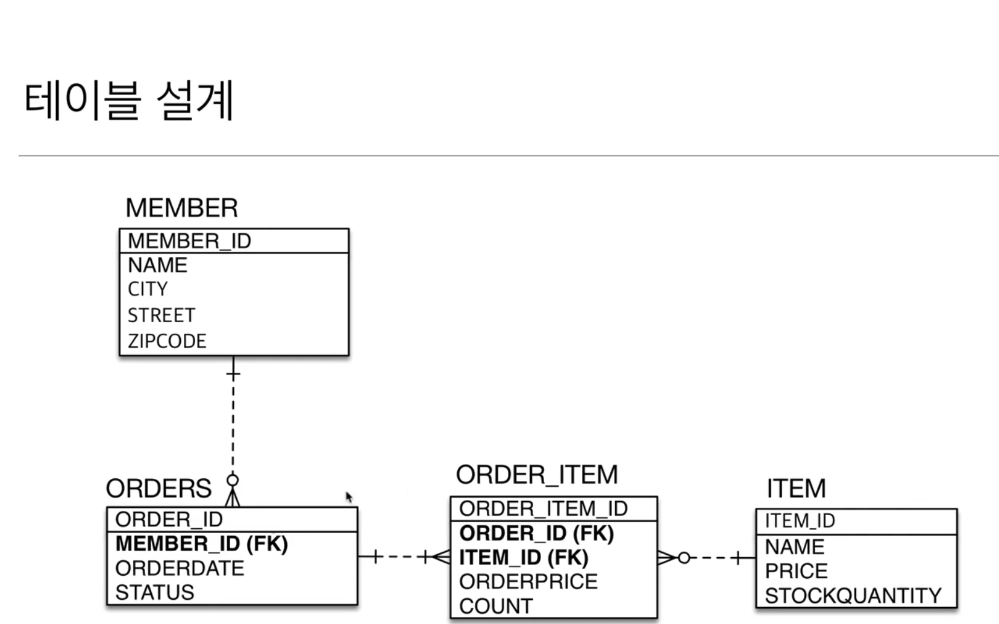

## 연관관계 매핑 예제1 - 데이터 중심의 설계

### 엔티티 구조

(출처 : 자바 ORM 표준 JPA 프로그래밍 - 기본편 실전 예제1)

#### 데이터 중심의 설계 
 - 객체 설계 방식을 테이블 설계에 맞춘 방식
 - 테이블의 외래키를 그대로 가져다 사용
 - 객체 그래프 탐색이 불가능 new Member().getOrder().getItem() X
 - 참조가 잘못되어 있으므로 UML도 잘못됨