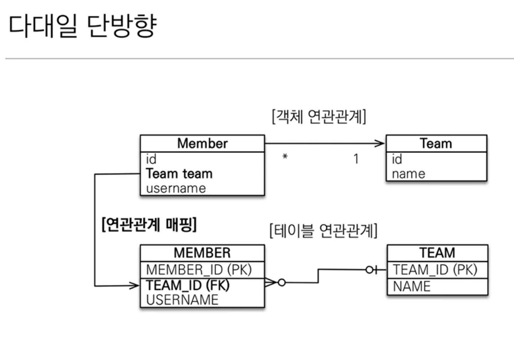
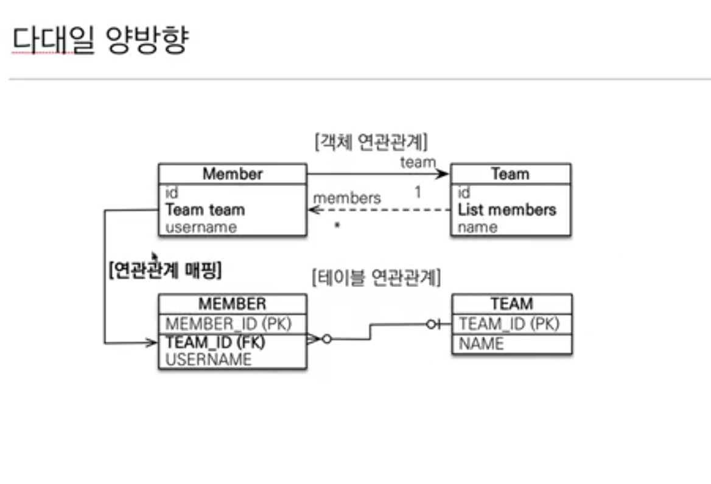
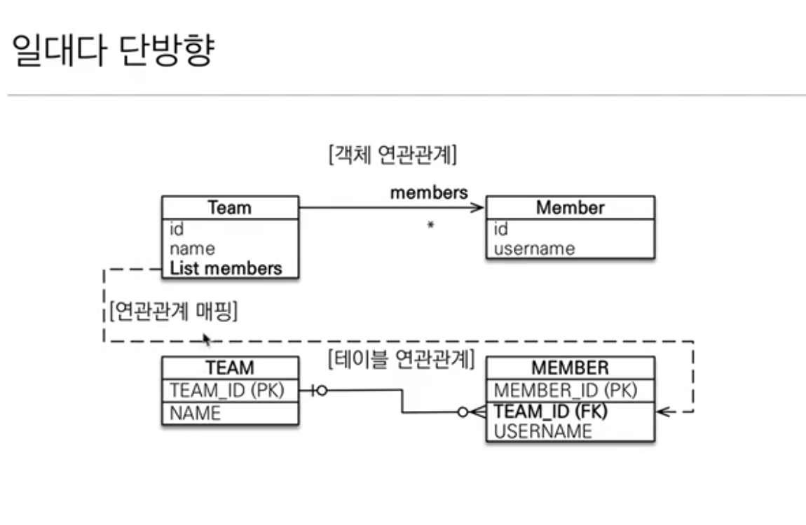
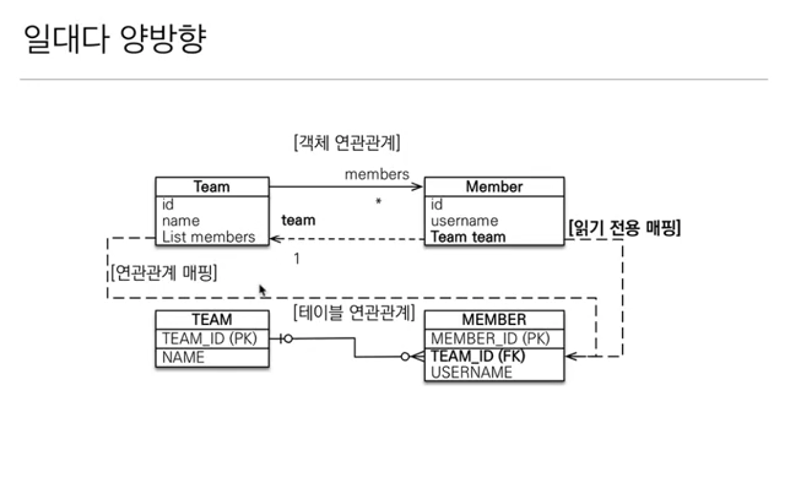
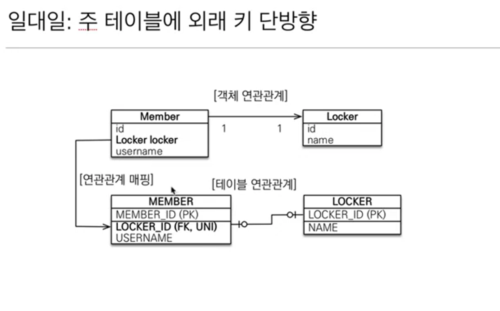
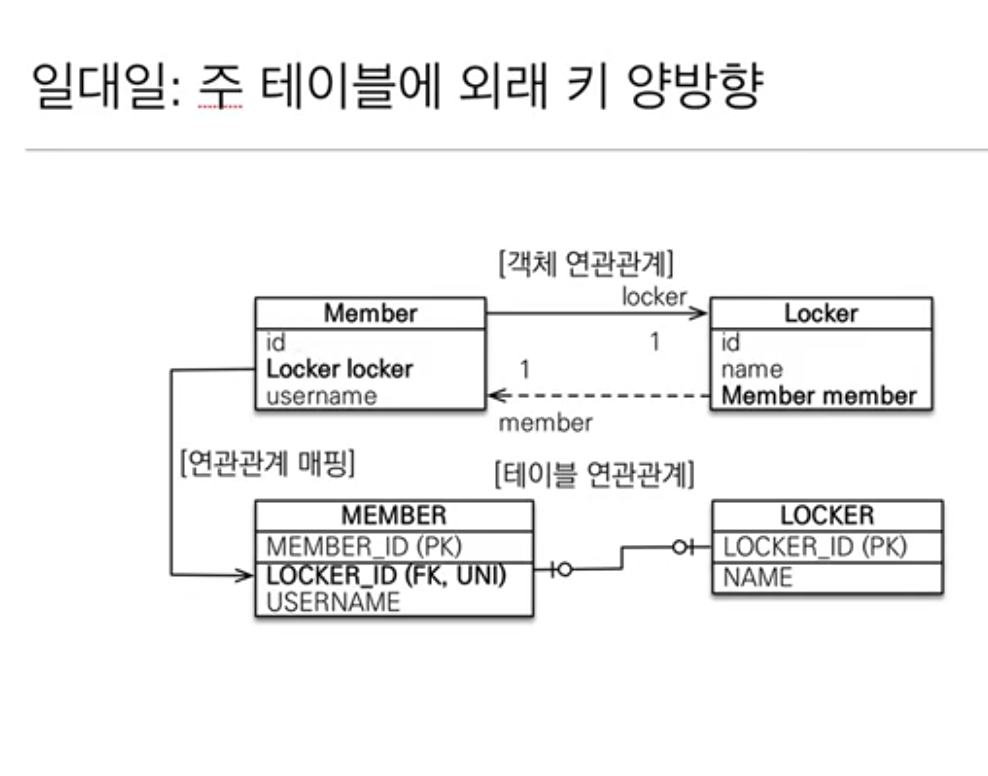
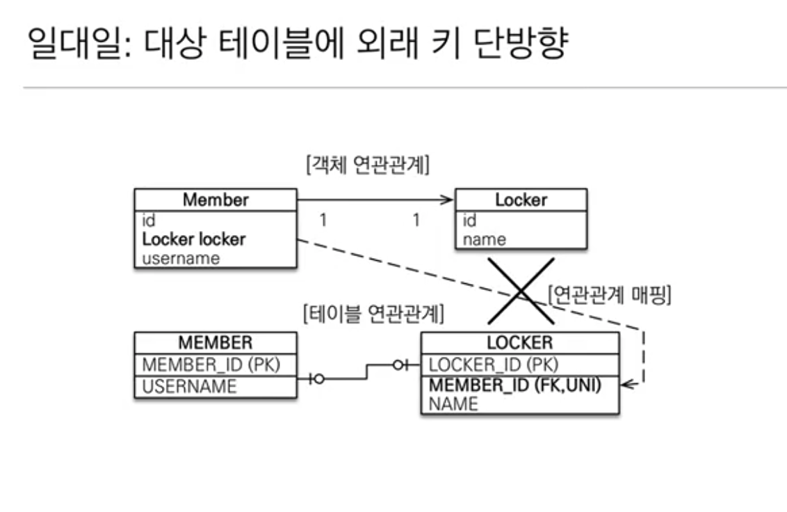
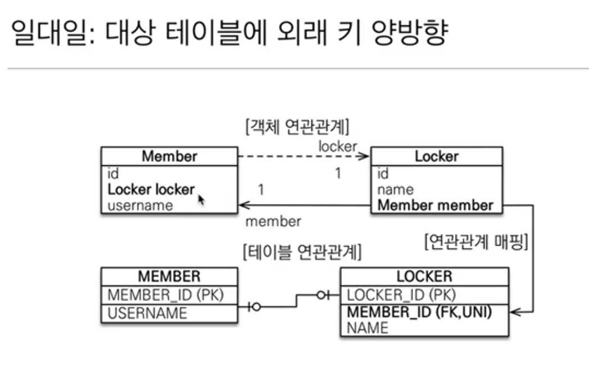
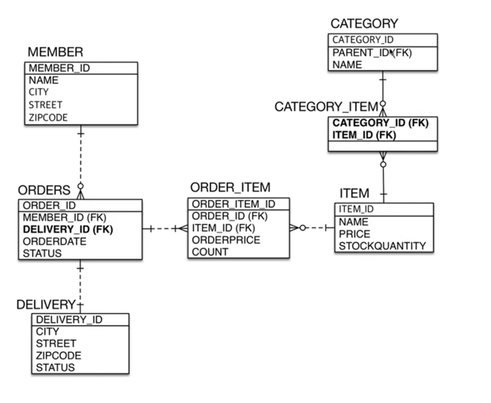
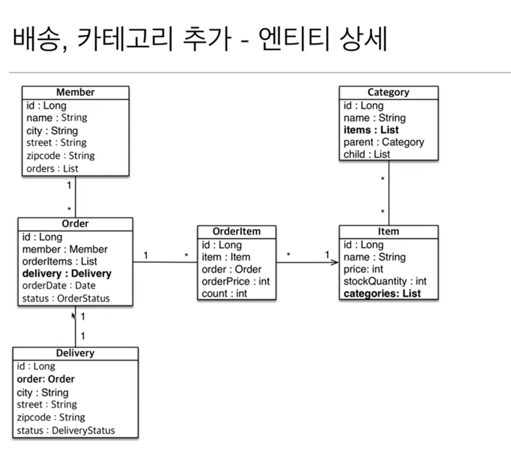

## 연관관계 매핑

### 1.다대일 [N : 1]
- #### 다대일 단방향 
  
  - 가장 많이 사용하는 연관관계
  

- #### 다대일 양방향
  
  - 외래키가 있는 쪽이 연관관계의 주인 (반대는 읽기만 가능, mappedBy)
  - 양쪽을 서로 참조하도록 개발
  - 다대일로 구현하고 필요한 경우 사용

### 2. 일대다 [1 : N] 
- #### 일대다 단방향(안쓰는걸 추천, 다대일 양방향 매핑을 사용하자)
  
  - 일(1)이 연관관계의 주인
  - 테이블 일대다 관계는 항상 다(N)쪽에 외래키가 있음
  - 객체와 테이블 차이 떄문에 반대편 테이블의 외래키를 관리하는 구조
  - @JoinColumn을 꼭 사용해야함. 그렇지 않으면 조인 테이블 방식을 사용함(중간에 테이블 하나 추가)
  - 엔티티가 관리하는 외래 키가 다른 테이블에 있음
  - 연관관계 관리를 위해 추가로 UPDATE SQL 실행
  
- #### 일대다 양방향(안쓰는걸 추천, 다대일 양방향 매핑을 사용하자)
  
  - 공식적으로 존재하지 않음.
  - @JoinColumn(insertable=false, updateable=false)
  - 읽기 전용 필드를 사용해서 양방향 처럼 사용하는 방법
  - 다대일 양방향을 사용하자

### 3. 일대일 [1 : 1]
  - 일대일 관계는 반대도 일대일
  - 주 테이블이나 대상 테이블 중에 외래 키 선택 가능
  - 주 테이블에 외래 키
  - 대상 테이블에 외래 키
  - 외래 키에 데이터베이스 유니크(UNI) 제약조건 추가

  - #### 주테이블에 외래키 단뱡향 
    
    - 다대일 단방향과 유사함
    
  - #### 주테이블에 외래키 양방향 
    
    - 다대일 양방향 매핑처럼 외래키가 있는 곳이 연관관계 주인
    - 반대편에 mappedBy 적용
    
  - #### 대상 테이블에 외래키 단방향(X)
    
    - JPA 지원하지않음
    
  - #### 대상 테이블에 외래키 양방향
    
    - 일대일 주 테이블에 외래키 양방향과 매핑 방법이 같음 
    
  - #### 주 테이블에 외래키 정리
    - 주 객체가 대상 객체의 참조를 가지는 것처럼 주 테이블에 외래키를 두고 대상 테이블을 찾음
    - 객체지향 개발자 선호
    - JPA 매핑 편리
    - 장점 : 주 테이블만 조회해도 대상 테이블에 데이터가 있는지 확인가능  => User.getOrder().getItem()
    - 단점 : 값이 없으면 외래 키에 null 허용
 
  - #### 대상 테이블에 외래키 정리
    - 대상 테이블에 외래 키가 존재 
    - 전통적인 데이터베이스 개발자 선호
    - 장점 : 주 테이블과 대상 테이블을 일대일에서 일대다 관계로 변경할 때 테이블 구조 유지
    - 단점 : 프록시 기능의 한계로 지연 로딩으로 설정해도 항상 즉시 로딩됨

### 4. 다대다 [N : M] (쓰지말자)
 - 관계형 데이터베이스는 정규화된 테이블 2개로 다대다 관계를 표현할 수 없다.
 - 객체는 컬렉션을 사용해서 객체 2개로 다대다 관계 가능.. 띠용.. 
 - @ManyToMany, @JoinTable
 - 실무 사용 X 
 - => 연결 테이블용 엔티티 추가해서 사용

## 연관관계 매핑 예제3 - 다양한 연관관계 매핑

### 엔티티 구조

(출처 : 자바 ORM 표준 JPA 프로그래밍 - 기본편 실전 예제3)
