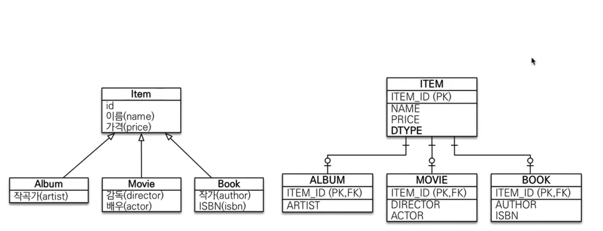
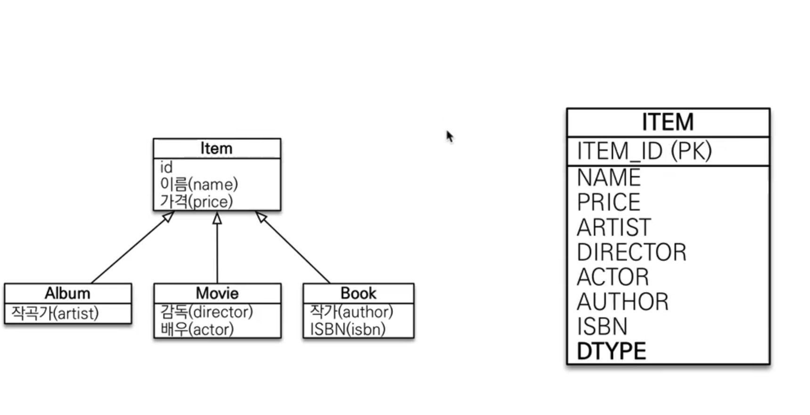
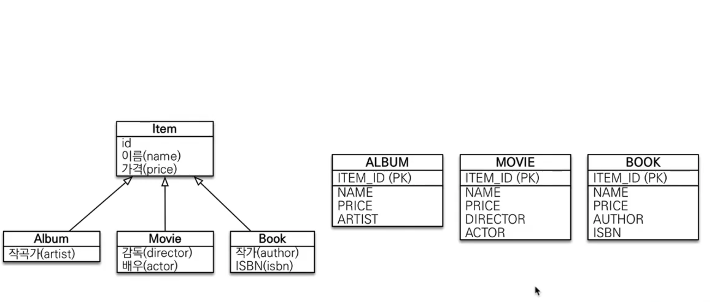
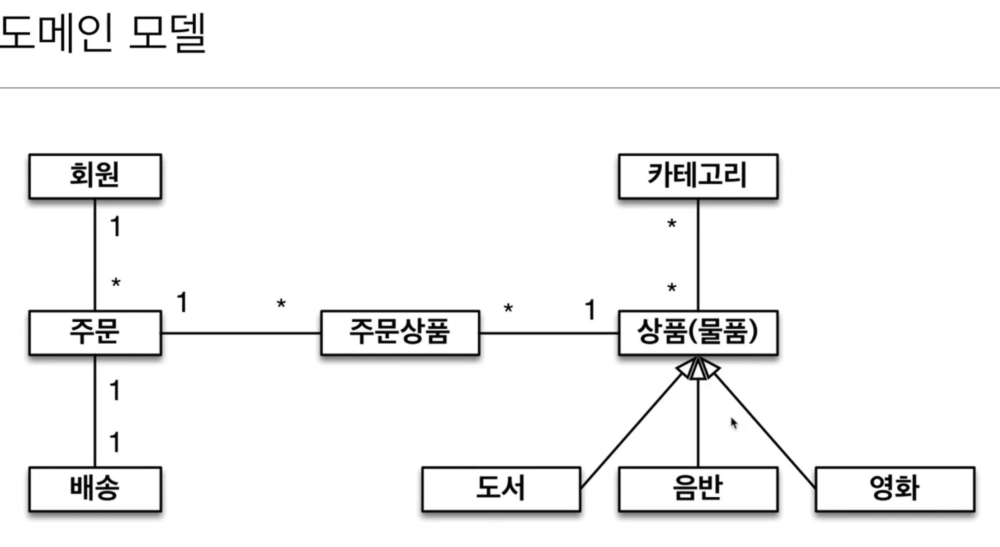

## 상속관계 매핑

### 상속관계 매핑
 - 관계형 데이터베이스는 상속 관계가 없음
 - 슈퍼 타입 서브 타입 관계라는 모델링 기법이 객체 상속과 유사함
 - 상속관계 매핑 : 객체의 상속과 구조와 DB의 슈퍼타입 서브타입 관계를 매핑

#### 주요 어노테이션 
 - @Inheritance(strategy=InheritanceType.XXX)
 - #### JOINED : 조인 전략
   
   ##### 장점
   - 테이블 정규화
   - 외래 키 참조 무결성 제약조건 활용가능
   - 저장공간 효율화
   ##### 단점
   - 조회 시 조인 많이 사용, 성능 저하
   - 조회 쿼리가 복잡함
   - 데이터 저장시 INSERT SQL 2개
   
 - #### SINGLE_TABLE : 단일 테이블 전략
   
   ##### 장점
   - 조인이 필요없으므로 조회가 빠름
   - 조회 쿼리가 단순
   ##### 단점
   - 자식 엔티티가 매핑한 컬럼은 모두 null 허용.
   - 테이블이 커질 수가 있고 상황에 따라 성능이 느려질 수 있다.
   
 - #### TABLE_PER_CLASS : 구현 클래스마다 테이블 전략(비추..)
   
   ##### 장점
   - 서브 타입을 명확하게 구분해서 처리할 때 효과적
   - not null 제약 조건을 사용 가능
   ##### 단점
   - 여러 자식 테이블과 함께 조회할 떄 성능이 느림(UNION SQL)
   - 자식 테이블을 통합해서 쿼리하기 어려움
 - @DiscriminatorColumn(name = "DTYPE")
 - @DiscriminatorValue("XXX")

### @MappedSuperclass
 - 공통 매핑 정보가 필요할 때 사용(id, name)
 - 상속 관계 매핑X
 - 엔티티X, 테이블과 매핑X
 - 부모 클래스를 상속 받는 자식 클래스에 매핑 정보만 제공
 - 조회, 검색 불가(em.find(BaseEntity) X)
 - 직접 생성해서 사용할 일이 없으므로 추상 클래스를 권장
 - 테이블과 관계 없고, 단순히 엔티티가 공통으로 사용하는 매핑 정보를 모으는 역할
 - 주로 등록일, 수정일, 등록자, 수정자 같은 전체 엔티티에서 공통적으로 적용하는 정보를 모을 때 사용
 - @Entity클래스는 엔티티나 @MappedSuperclass로 지정한 클래스만 상속 가능

## 실전 예제4 - 상속관계 매핑

###요구사항

