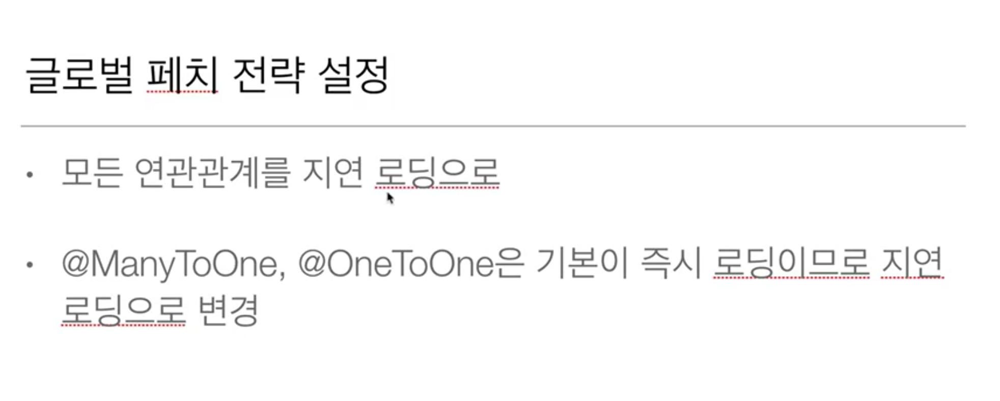
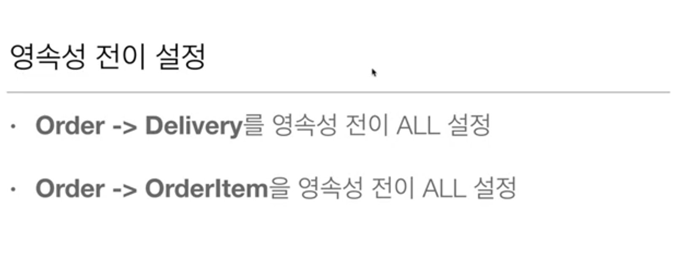
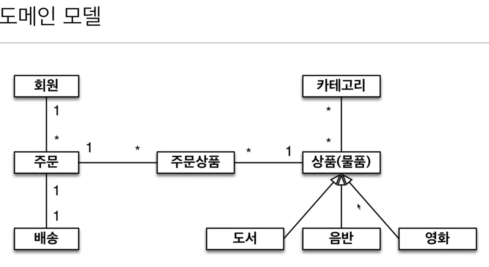
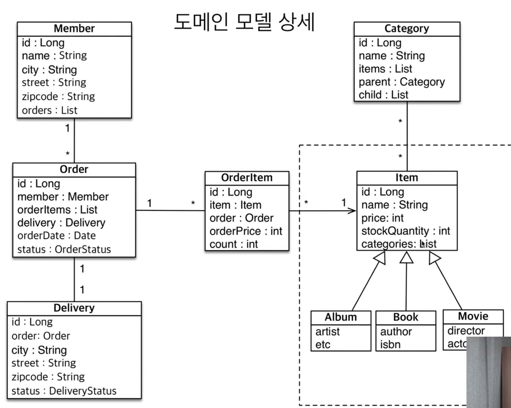

## 프록시와 연관관계 관리

### 프록시
 - em.find() vs em.getReference() 
 - em.find() : 데이터베이스를 통해서 실제 엔티티 객체 조회
 - em.getReference() : 데이터베이스 조회를 미루는 가짜(프록시) 엔티티 객체 조회

#### 프록시 특징 
 - 실제 클래스를 상속받아서 만들어짐
 - 실제 클래스와 겉 모양이 같다.
 - 사용하는 입장에서는 진짜인지 프록시 객체인지 구분하지 않고 사용하면 된다.
 - 프록시 객체는 실제 객체의 참조(target)을 보관
 - 프록시 객체를 호출하면 프록시 객체는 실제 객체의 메소드 호출
 - 프록시 객체는 처음 사용할 때 한번만 초기화
 - 프록시 객체를 초기화 할 때, 프로깃 객체가 실제 엔티티로 바뀌는 것이 아님, 초기화되면 프록시 객체를 통해 실제 엔티티에 접근
 - 프록시 객체는 원본 엔티티를 상속받음, 따라서 타입 체크시 주의해야함(== 비교 실패, 대신 instance of 사용)
 - 영속성 컨텍스트에 찾는 엔티티가 이미 있으면 em.getReference()를 호출해도 실제 엔티티를 반환(반대도 동일)
 - 영속성 컨텍스트의 도움을 받을 수 없는 준영속 상태일 떄, 프록시를 초기화화면  문제가 발생함(Hibernate의 경우 org.hibernate.LazyInitializationException예외가 발생한다)

#### 프록시 확인
 - 프록시 인스턴스의 초기화 여부 확인
   - PersistenceUnitUtil.isLoaded(Object entity)
 - 프록시 클래스 확인 방법
   - entity.getClass().getName() (HibernateProxy...)
 - 프록시 강제 초기화
   - org.hibernate.Hibernate.initialize()
 - JPA 표준은 강제 초기화 없음.(get 메소드 호출로 강제호출)

### 즉시로딩과 지연로딩

#### 프록시와 지연로딩 주의
 - 가급적 지연로딩만 사용(실무에서 N+1 문제로 성능에 문제를 일으킬 수 있음)
 - 즉시 로딩을 적용하면 예상하지 못한 SQL이 발생
 - 즉시로딩은 JPQL에서 N+1문제를 일으킨다
 - @ManyToOne, @OneToOne은 기본이 즉시로딩 -> LAZY로 설정할것!
 - @OneToMany, @ManyToMany는 기본이 지연로딩 

#### 지연로딩 활용 실무
 - 모든 연관 관계에 지연 로딩을 사용하자
 - JPQL fetch 조인이나 엔티티 그래프를 사용하자
 - 즉시 로딩은 상상하지 못한 쿼리가 발생한다

### 영속성 전이 : CASCADE
 - 특정 엔티티를 영속성 상태로 만들 때 연관된 엔티티도 함께 영속 상태로 만들고 싶을 때
 - ex) 부모 엔티티를 저장할 때 자식 엔티티도 함께 저장
 - 영속성 전이는 연관관계를 매핑하는 것과 아무 연관 관계가 없음
 - 엔티티를 영속화 할 때 연관된 엔티티 함께 영속화하는 편리함을 제공할 뿐

#### CASCADE 종류
 - ALL : 모두 적용
 - PERSIST : 영속
 - REMOVE : 삭제
 - MERGE : 병합
 - REFRESH : REFRESH
 - DETACH : DETACH

### 고아 객체 
 - 고아 객체 제거 : 부모 엔티티와 연관 관계가 끊어 자식 엔티를 자동으로 삭제
 - orphanRemoval=true
 - Parent.getChild().remove(0); //자식 엔티티를 컬렉션에서 제거
 - DELETE FROM CHILD WHERE ID = ?

#### 고아객체 주의
 - 참조가 제거된 엔티티 다른 곳에서 참조되지 않은 객체로 보고 삭제하는 기능
 - 참조하는 곳이 하나일 때 사용해야함
 - 특정 엔티티를 개인이 소유할 때 사용
 - @OneToOne, @ManyToOne 일 때만 사용 가능

#### 영속성 전이 + 고아객체, 생명주기 
 - CascadeType.ALL, orphanRemoval=true
 - 스스로 생명주기를 관리하는 엔티티는 em.persist()로 영속화, em.remove()로 제거
 - 부모 엔티티가 자식 엔티티를 관리한다

## 실전 예제5 - 연관 관계 관리

### 요구사항

