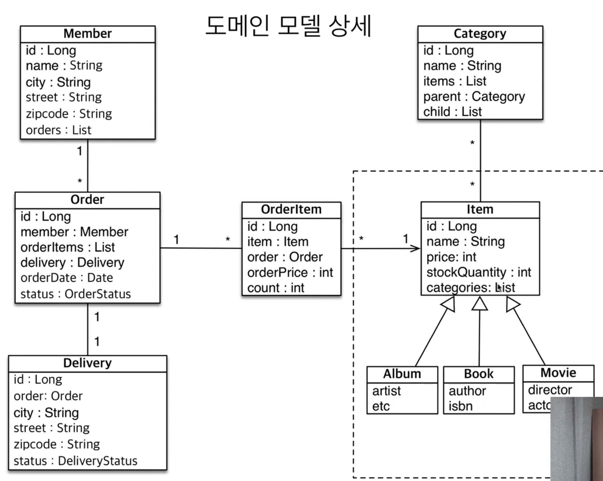

## 값 타입

### JPA 데이터 타입 분류 
 - ##### 엔티티 타입 
   - @Entity로 정의하는 객체
   - 데이터가 변해도 ```식별자```로 지속해서 추적 가능
   - ex) 회원 엔티티의 키나 나이 값을 변경해도 ```식별자```로 인식 가능
 - ##### 값 타입 
   - int, Integer, String 처럼 단순히 값으로 사용하는 자바 기본 타입이나 객체
   - 식별자가 없고 값만 있으므로 변경 시 추적 불가
   - 예) 숫자 100을 200으로 변경하면 완전히 다른 값으로 대체
   
### 값 타입 분류
 - ##### 기본값 타입 : 생명주기를 엔티티에 의존, 값 타입은 공유하면 안된다
   - 자바 기본 타입(int, double)
   - 래퍼 클래스(Integer, Long)
   - String
   - cf) int, double 자바의 기본 타입은 절대 공유X. 기본 타입은 항상 값을 복사함. Integer같은  래퍼 클래스나 String 같은 특수한 클래스는 공유 가능한 객체이지만 변경 X
   
 - ##### 임베디드 타입(embedded type, 복합 값 타입)
   - 새로운 값  타입을 직접 정의할 수 있음
   - JPA는 임베디드 타입이라고 함 
   - 주로 기본 값 타입을 모아서 만들어서 복합 값 타입이라고 함
   - int, String과 같은 값 타입 
   - 임베디드 타입은 엔티티의 값일 뿐이다.
   - 임베디드 타입을 사용하기 전과 후에 매핑하는 테이블은 같다.
   - 객체와 테이블을 아주 세밀하게 매핑하는 것이 가능
   - 잘 설계한 ORM 에플리케이션은 매핑한 테이블의 수보다 클래스의 수가 더 많음
   - @AttributeOverrides, @AttributeOverride 컬럼 값이 중복일 때 
   - 임베디드 타입 값이 null이면 매핑한 컬럼 값은 모두 null

   - #### 값 타입과 불변 객체
     - 임베디드 타입 같은 값 타입을 여러 엔티티에서 공유하면 위험함
     - 부작용 발생, 값을 복사해서 사용할 것.
   
     - #### 객체 타입의 한계 
       - 항상  값을 복사해서 사용하면 공유 참조로 인해 발생하는 부작용을 피할 수 있다.
       - 문제는 임베디드 타입처럼 직접 정의한 값 타입은 자바의 기본 타입이 아니라 객체 타입이다.
       - 자바 기본 타입에 값을 대입하면 값을 복사한다.
       - 객체 타입은 ```참조 값을 직접 대입하는 것```을 막을 방법이 없다...
       - 객체의 ```공유 참조```는 피할 수 없다
   
     - #### 불변 객체 (값 타입은 불변 객체로 만들어야 부작용이 없다)
       - 객체 타입을 수정할 수 없게 만들면 부작용을 원천 차단
       - 값 타입은 ```불변 객체```로 설계해야 함
       - 불변 객체 : 생성 시점 이후 절대 값을 변경할 수 없는 객체
       - 생성자로만 값을 설정하고 수정자(setter)를 만들지 않는다.
       - 참고) Integer,String은 자바가 제공하는 대표적인 불변 객체

     - #### 값 타입의 비교
       - 동일성(identity) 비교: 인스턴스의 참조 값을 비교, == 사용
       - 동등성(equivalence) 비교: 인스턴스의 값을 비교, equals()
       - 값 타입은 a.equals(b)를 사용해서 동등성 비교해야 함
       - 값 타입의 equals() 메소드를 적절하게 재정의{(주로 모든 필드 값)
   
 - #### 컬렉션 값 타입(collection value type) - 쓰지 않는 것을 추천한다..
   - 값 타입을 하나 이상 저장할 떄 사용
   - @ElementCollection, @CollectionTable 사용
   - 데이터베이스는 컬렉션 같은 테이블에 저장할 수 없다.
   - 컬렉션을 저장하기 위한 ```별도의 테이블```이 필요함
   - 값 타입 컬렉션은 영속성 전이 + 고아 객체 제거 기능을 필수로 가짐
   
   - ##### 값 타입 컬렉션의 제약 사항
     - 값 타입은 엔티티와 다르게 식별자 개념이 없다.
     - 값은 변경하면 추적이 어렵다.
     - 값 타입 컬렉션에 변경 사항이 발생하면, 주인 엔티티와 연관된 모든 데이터를 삭제하고, 값 타입 컬렉션에 있는 현재 값을 모두 다시 저장한다.
     - 값 타입 컬렉션을 매핑하는 테이블은 모든 컬럼을 묶어서 기본 키로 구성해야 함. (NOT NULL, 중복X)
   
   - ##### 값 타입 컬렉션의 대안 
     - 값 타입 컬렉션 대신에 일대다 관계를 고려
     - ex) AddressEntity


## 실전 예제6 - 값 타입 매핑

### 요구사항
 - Member, Delivery Address 값 타입으로 변경하기
